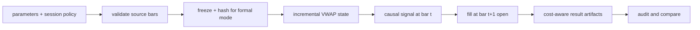

# Method Guide

## Workflow

1. Confirm the task mode: standalone signal research or formal SSQuant futures evaluation.
2. Present and record parameters, including session policy, fees, slippage, multiplier, margin,
   initial capital, quantity, and adjustment mode.
3. Load and validate one symbol at a time. Sort bars, validate OHLCV, preserve source metadata,
   and reset rolling state at session boundaries.
4. Generate signals incrementally from the current bar and prior bars only. Queue every order for
   the next bar open.
5. For formal work, freeze the official transformed bars, record source hashes and the combined
   bars hash, then run only from that manifest.
6. Emit governed artifacts and run the review checklist before comparing variants.
7. Keep generated artifacts, caches, and logs in the external run directory.

## Mode Separation

Formal mode also requires an external SSQuant project root and engine path. These runtime
dependencies are configured with `SSQUANT_PROJECT_ROOT` and `SSQUANT_ENGINE_PATH`; they are not
copied into the skill package.

| Mode | Purpose | Data | PnL source | Status |
|---|---|---|---|---|
| Standalone | signal and cost-model research | official adapter or synthetic debug data | standalone harness | exploratory |
| Formal | futures strategy evaluation | frozen official transformed bars | SSQuant `AccountBridge` | publishable only after audit |

## Workflow Diagram

## Comparison Rule

Two results may be compared only after their manifests prove identical bars, adjustment mode,
strategy identity, initial capital, and cost assumptions, or explicitly document why the inputs
are intentionally different.
